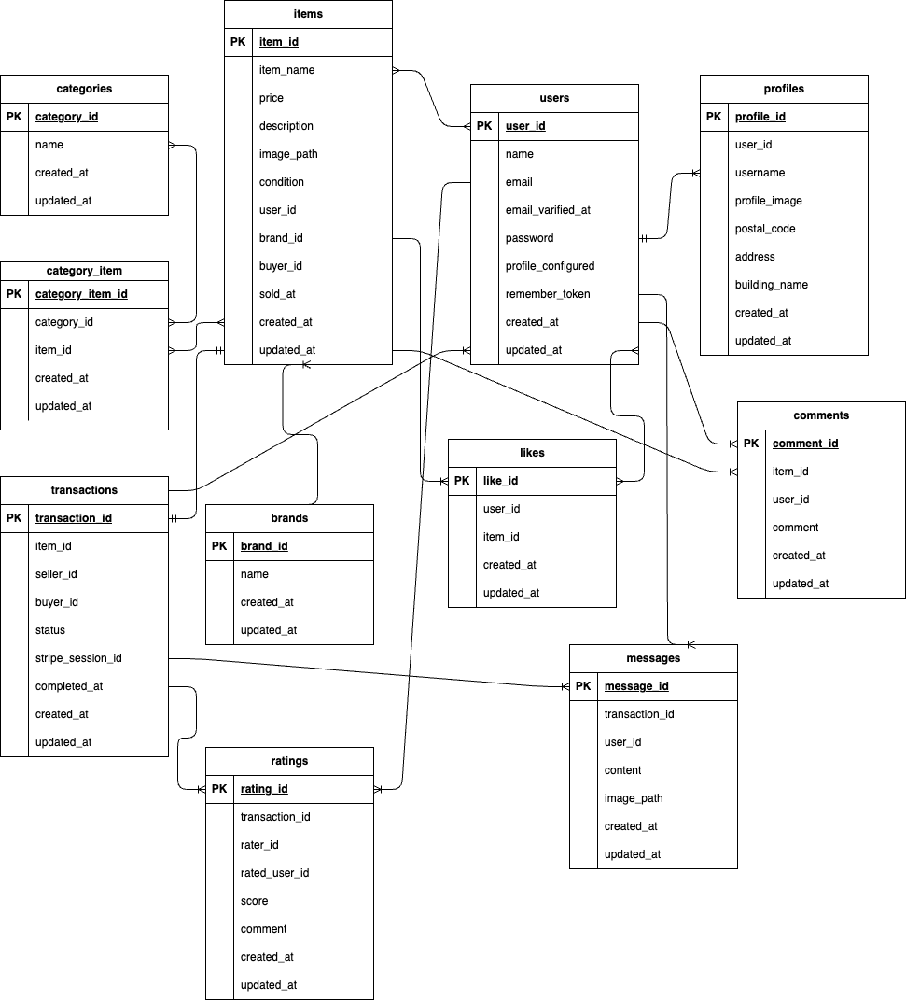

# coachtechフリマ

## 環境構築
Dockerビルト
1. git clone git@github.com:yoshizawakei/test-project1.git
2. docker-compose up -d --build
※MySQLは、OSによって起動しない場合があるので、それぞれのPCに合わせてdocker-compose.ymlファイルを編集してください。

Laravel環境構築
1. docker-compose exec php bash
2. composer install
3. .env.exampleファイルから.envを作成し、環境変数を変更(DB,MAIL,STRIPE)
4. php artisan key:generate
5. php artisan migrate
6. php artisan db:seed
7. php artisan storage:link
8. composer require intervention/image

## 使用技術(実行環境)
- PHP 7.4.33
- Laravel 8.83.29
- MySQL 15.1

## ER図


## URL
- 開発環境：http://localhost/
- phpMyAdmin：http://localhost:8080/

## メール認証
mailtrapというツールを使用しています。<br>
以下のリンクから会員登録をしてください。　<br>
https://mailtrap.io/

メールボックスのIntegrationsから 「laravel 7.x and 8.x」を選択し、　<br>
.envファイルのMAIL_MAILERからMAIL_ENCRYPTIONまでの項目をコピー＆ペーストしてください。　<br>
MAIL_FROM_ADDRESSは任意のメールアドレスを入力してください。　

## Stripeについて
コンビニ支払いとカード支払いのオプションがありますが、決済画面にてコンビニ支払いを選択しますと、レシートを印刷する画面に遷移します。そのため、カード支払いを成功させた場合に意図する画面遷移が行える想定です。<br>

また、StripeのAPIキーは以下のように設定をお願いいたします。
```
STRIPE_PUBLIC_KEY="パブリックキー"
STRIPE_SECRET_KEY="シークレットキー"
```

以下のリンクは公式ドキュメントです。<br>
https://docs.stripe.com/payments/checkout?locale=ja-JP

## テーブル仕様
### usersテーブル
| カラム名 | 型 | primary key | unique key | not null | foreign key |
| --- | --- | --- | --- | --- | --- |
| id | bigint | ◯ |  | ◯ |  |
| name | varchar(255) |  |  | ◯ |  |
| email | varchar(255) |  | ◯ | ◯ |  |
| email_verified_at | timestamp |  |  |  |  |
| password | varchar(255) |  |  | ◯ |  |
| profile_configured | boolean |  |  | ◯ |  |
| remember_token | varchar(100) |  |  |  |  |
| created_at | timestamp |  |  |  |  |
| updated_at | timestamp |  |  |  |  |

### profilesテーブル
| カラム名 | 型 | primary key | unique key | not null | foreign key |
| --- | --- | --- | --- | --- | --- |
| id | bigint | ◯ |  | ◯ |  |
| user_id | bigint |  | ◯ | ◯ | users(id) |
| username | varchar(255) |  | ◯ | ◯ |  |
| profile_image | varchar(255) |  | ◯ | ◯ |  |
| postal_code | varchar(7) |  |  | ◯ |  |
| address | varchar(255) |  |  | ◯ |  |
| building_name | varchar(255) |  |  |  |  |
| created_at | timestamp |  |  |  |  |
| updated_at | timestamp |  |  |  |  |

### itemsテーブル
| カラム名 | 型 | primary key | unique key | not null | foreign key |
| --- | --- | --- | --- | --- | --- |
| id | bigint | ◯ |  | ◯ |  |
| user_id | bigint |  |  | ◯ | users(id) |
| item_name | varchar(255) |  |  | ◯ |  |
| price | int |  |  | ◯ |  |
| description | text |  |  | ◯ |  |
| image_path | varchar(255) |  |  | ◯ |  |
| condition | varchar(255) |  |  | ◯ |  |
| brand_id | bigint |  |  |  | brands(id) |
| sold_at | timestamp |  |  |  |  |
| buyer_id | bigint |  |  |  | users(id) |
| payment_method | varchar(255) |  |  |  |  |
| created_at | timestamp |  |  |  |  |
| updated_at | timestamp |  |  |  |  |

### commentsテーブル
| カラム名 | 型 | primary key | unique key | not null | foreign key |
| --- | --- | --- | --- | --- | --- |
| id | bigint | ◯ |  | ◯ |  |
| user_id | bigint |  |  | ◯ | users(id) |
| item_id | bigint |  |  | ◯ | items(id) |
| comment | text |  |  | ◯ |  |
| created_at | timestamp |  |  |  |  |
| updated_at | timestamp |  |  |  |  |

### likesテーブル
| カラム名 | 型 | primary key | unique key | not null | foreign key |
| --- | --- | --- | --- | --- | --- |
| id | bigint | ◯ |  | ◯ |  |
| user_id | bigint |  | ◯(item_idとの組み合わせ) | ◯ | users(id) |
| item_id | bigint |  | ◯(user_idとの組み合わせ) | ◯ | items(id) |
| created_at | timestamp |  |  |  |  |
| updated_at | timestamp |  |  |  |  |

### category_item (中間テーブル)
| カラム名 | 型 | primary key | unique key | not null | foreign key |
| --- | --- | --- | --- | --- | --- |
| id | bigint | ◯ |  | ◯ |  |
| item_id | bigint |  | ◯(category_idとの組み合わせ) | ◯ | items(id) |
| category_id | bigint |  | ◯(item_idとの組み合わせ) | ◯ | categories(id) |
| created_at | created_at |  |  |  |  |
| updated_at | updated_at |  |  |  |  |

### categoriesテーブル
| カラム名 | 型 | primary key | unique key | not null | foreign key |
| --- | --- | --- | --- | --- | --- |
| id | bigint | ◯ |  | ◯ |  |
| name | varchar(255) |  | ◯ | ◯ |  |
| created_at | timestamp |  |  |  |  |
| updated_at | timestamp |  |  |  |  |

### brandsテーブル
| カラム名 | 型 | primary key | unique key | not null | foreign key |
| --- | --- | --- | --- | --- | --- |
| id | bigint | ◯ |  | ◯ |  |
| name | varchar(255) |  | ◯ | ◯ |  |
| created_at | timestamp |  |  |  |  |
| updated_at | timestamp |  |  |  |  |

### transactionsテーブル
| カラム名 | 型 | primary key | unique key | not null | foreign key |
| --- | --- | --- | --- | --- | --- |
| id | bigint | ◯ |  | ◯ |  |
| item_id | bigint |  |  | ◯ | items(id) |
| seller_id | bigint |  |  | ◯ | users(id) |
| buyer_id | bigint |  |  | ◯ | users(id) |
| status | varchar(255) |  |  | ◯ |  |
| stripe_session_id | varchar(255) |  | ◯ | ◯ |  |
| completed_at | timestamp |  |  |  |  |
| created_at | timestamp |  |  |  |  |
| updated_at | timestamp |  |  |  |  |

### ratingsテーブル
| カラム名 | 型 | primary key | unique key | not null | foreign key |
| --- | --- | --- | --- | --- | --- |
| id | bigint | ◯ |  | ◯ |  |
| transaction_id | bigint |  | ◯(rater_idとの組み合わせ) | ◯ | transactions(id) |
| rater_id | bigint |  | ◯(transaction_idとの組み合わせ) | ◯ | users(id) |
| rated_user_id | bigint |  |  | ◯ | users(id) |
| score | tinyint |  |  | ◯ |  |
| comment | text |  |  |  |  |
| created_at | timestamp |  |  |  |  |
| updated_at | timestamp |  |  |  |  |

### messagesテーブル
| カラム名 | 型 | primary key | unique key | not null | foreign key |
| --- | --- | --- | --- | --- | --- |
| id | bigint | ◯ |  | ◯ |  |
| transaction_id | bigint |  |  | ◯ | transactions(id) |
| user_id | bigint |  |  | ◯ | users(id) |
| content | text |  |  | ◯ |  |
| image_path | varchar(255) |  |  |  |  |
| created_at | timestamp |  |  |  |  |
| updated_at | timestamp |  |  |  |  |

## テストアカウント
name: 山田太郎
email: test@example.com
password: password
-------------------------
name: 佐藤花子
email: test@example.co.jp
password: password
-------------------------

## PHPUnitを利用したテストに関して
以下のコマンド:
```
//テスト用データベースの作成
docker-compose exec mysql bash
mysql -u root -p
//パスワードはrootと入力
CREATE DATABASE test_database;

//configディレクトリの中のdatabase.phpを開き、mysqlの配列部分をコピーして新たにmysql_testを作成。
次に、配列の中のdatabase、username、passwordは以下のように変更。
'database' => 'demo_test',
'username' => 'root',
'password' => 'root',

//テスト用の.envファイル作成
cp .env .env.testing
.env.testingを以下のとおり編集
APP_ENV=test
APP_KEY=
DB_DATABASE=demo_test
DB_USERNAME=root
DB_PASSWORD=root

docker-compose exec php bash
php artisan key:generate --env=testing
php artisan migrate --env=testing

//phpunit.xmlを開き、DB_CONNECTIONとDB_DATABASEを以下のように変更
<server name="DB_CONNECTION" value="mysql_test"/>
<server name="DB_DATABASE" value="demo_test"/>

//テストの実行
./vendor/bin/phpunit

//ブラウザテストを実行する場合
composer require laravel/dusk --dev
php artisan dusk:install
.envと.env.testingのAPP_URLをhttp://nginxに変更
php artisan dusk
```